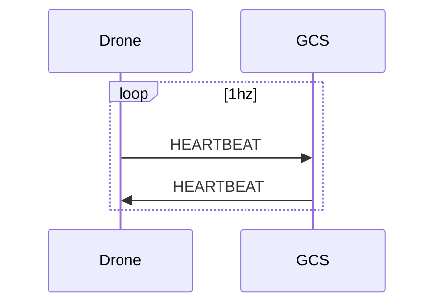
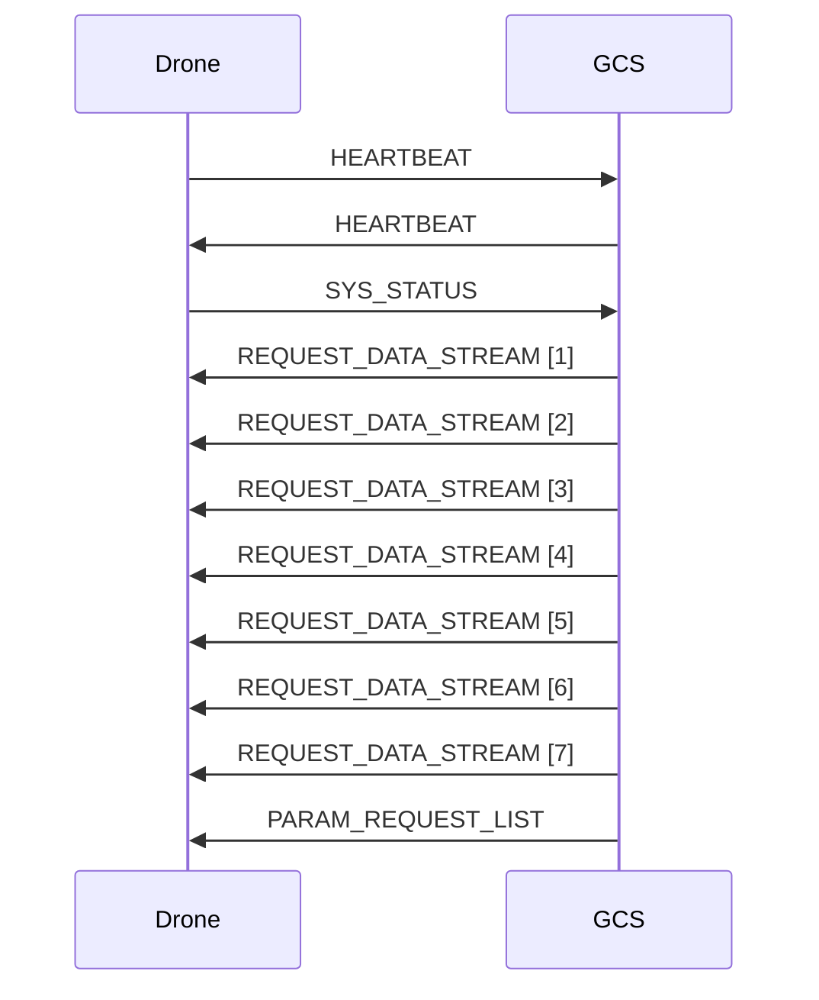

# Data Streams
## HEARTBEAT


# Initialization


## REQUEST_DATA_STREAM Message

## [Message Structure](https://mavlink.io/en/messages/common.html#REQUEST_DATA_STREAM)

```json
[
    {
        "sequence_diagram_index": {
            "type": "integer",
            "description": "The index of the sequence diagram, not part of the MAVLink specification."
        },
        "mavpackettype": {
            "type": "string",
            "value": "REQUEST_DATA_STREAM",
            "description": "The type of MAVLink packet, indicating a request for data streams."
        },
        "target_system": {
            "type": "uint8_t",
            "description": "System ID of the target system requested to send the message stream. For example, in a drone fleet, this could be the ID of a specific drone. The default is 255 so that is what ZP will use."
        },
        "target_component": {
            "type": "uint8_t",
            "description": "Component ID of the target component requested to send the message stream. For example, a drone, this could be the ID of a specific component on a drone. In our case, this is always zp with a value of 0."
        },
        "req_stream_id": {
            "type": "uint8_t",
            "description": "ID of the requested data stream. Each ID corresponds to a specific type of data, such as position, attitude, etc.",
            "mavlink_docs": "https://mavlink.io/en/messages/common.html#MAV_DATA_STREAM"
        },
        "req_message_rate": {
            "type": "uint16_t",
            "units": "Hz",
            "description": "The rate at which messages are requested, in hertz (Hz)."
        },
        "start_stop": {
            "type": "uint8_t",
            "description": "1 to start sending the requested data stream, 0 to stop sending."
        }
    }
]
```


```json
[
    {
        "sequence_diagram_index": 1,
        "mavpackettype": "REQUEST_DATA_STREAM",
        "target_system": 255,
        "target_component": 0,
        "req_stream_id": 2,
        "req_message_rate": 2,
        "start_stop": 1
    },
    {
        "sequence_diagram_index": 2,
        "mavpackettype": "REQUEST_DATA_STREAM",
        "target_system": 255,
        "target_component": 0,
        "req_stream_id": 6,
        "req_message_rate": 3,
        "start_stop": 1
    },
    {
        "sequence_diagram_index": 3,
        "mavpackettype": "REQUEST_DATA_STREAM",
        "target_system": 255,
        "target_component": 0,
        "req_stream_id": 10,
        "req_message_rate": 10,
        "start_stop": 1
    },
    {
        "sequence_diagram_index": 4,
        "mavpackettype": "REQUEST_DATA_STREAM",
        "target_system": 255,
        "target_component": 0,
        "req_stream_id": 11,
        "req_message_rate": 10,
        "start_stop": 1
    },
    {
        "sequence_diagram_index": 5,
        "mavpackettype": "REQUEST_DATA_STREAM",
        "target_system": 255,
        "target_component": 0,
        "req_stream_id": 12,
        "req_message_rate": 2,
        "start_stop": 1
    },
    {
        "sequence_diagram_index": 6,
        "mavpackettype": "REQUEST_DATA_STREAM",
        "target_system": 255,
        "target_component": 0,
        "req_stream_id": 1,
        "req_message_rate": 2,
        "start_stop": 1
    },
    {
        "sequence_diagram_index": 7,
        "mavpackettype": "REQUEST_DATA_STREAM",
        "target_system": 255,
        "target_component": 0,
        "req_stream_id": 3,
        "req_message_rate": 2,
        "start_stop": 1
    }
]


```

**Definitions of the req_stream_id can be found at: https://mavlink.io/en/messages/common.html#MAV_DATA_STREAM**

## REQUEST_DATA_STREAM [1]
```json
{
    "sequence_diagram_index": 1,
    "mavpackettype": "REQUEST_DATA_STREAM",
    "target_system": 255,
    "target_component": 0,
    "req_stream_id": 2,
    "req_message_rate": 2,
    "start_stop": 1
}
```
- **Explanation**:
  - **`target_system`**: 255 (Broadcast to all systems).
  - **`target_component`**: 0 (Targets the autopilot).
  - **`req_stream_id`**: 2, representing the **MAV_DATA_STREAM_EXTENDED_STATUS** stream, which includes [GPS_STATUS](https://mavlink.io/en/messages/common.html#GPS_STATUS), [CONTROL_STATUS](https://mavlink.io/en/messages/common.html#CONTROL_STATUS) and [AUX_STATUS](https://mavlink.io/en/messages/common.html#AUX_STATUS) messages.
  - **`req_message_rate`**: 2 Hz (Updates twice per second).
  - **`start_stop`**: 1 (Start sending this stream).

## REQUEST_DATA_STREAM [2]
```json 
{
    "sequence_diagram_index": 2,
    "mavpackettype": "REQUEST_DATA_STREAM",
    "target_system": 255,
    "target_component": 0,
    "req_stream_id": 6,
    "req_message_rate": 3,
    "start_stop": 1
}
```
- **Explanation**:
  - **`req_stream_id`**: 6, corresponding to the **	MAV_DATA_STREAM_POSITION** stream, which includes [LOCAL_POSITION](https://mavlink.io/en/messages/common.html#LOCAL_POSITION) and [GLOBAL_POSITION_INT](https://mavlink.io/en/messages/common.html#GLOBAL_POSITION_INT) messages.
  - **`req_message_rate`**: 3 Hz (Updates three times per second).
  - **`start_stop`**: 1 (Start sending this stream).

## REQUEST_DATA_STREAM [3]
```json 
{
    "sequence_diagram_index": 3,
    "mavpackettype": "REQUEST_DATA_STREAM",
    "target_system": 255,
    "target_component": 0,
    "req_stream_id": 10,
    "req_message_rate": 10,
    "start_stop": 1
}
```
- **Explanation**:
  - **`req_stream_id`**: 10, representing the **POSITION** stream, which provides GPS or local position data.
  - **`req_message_rate`**: 10 Hz (Updates ten times per second).
  - **`start_stop`**: 1 (Start sending this stream).

## REQUEST_DATA_STREAM [4]
```json 
{
    "sequence_diagram_index": 4,
    "mavpackettype": "REQUEST_DATA_STREAM",
    "target_system": 255,
    "target_component": 0,
    "req_stream_id": 11,
    "req_message_rate": 10,
    "start_stop": 1
}
```
- **Explanation**:
  - **`req_stream_id`**: 11, corresponding to the **EXTRA1** stream, which includes attitude data such as roll, pitch, and yaw.
  - **`req_message_rate`**: 10 Hz (Updates ten times per second).
  - **`start_stop`**: 1 (Start sending this stream).

## REQUEST_DATA_STREAM [5]
```json 
{
    "sequence_diagram_index": 5,
    "mavpackettype": "REQUEST_DATA_STREAM",
    "target_system": 255,
    "target_component": 0,
    "req_stream_id": 12,
    "req_message_rate": 2,
    "start_stop": 1
}
```
- **Explanation**:
  - **`req_stream_id`**: 12, representing the **EXTRA2** stream, which includes velocity data and additional telemetry such as heading, airspeed, and ground speed.
  - **`req_message_rate`**: 2 Hz (Updates twice per second).
  - **`start_stop`**: 1 (Start sending this stream).

## REQUEST_DATA_STREAM [6]
```json 
{
    "sequence_diagram_index": 6,
    "mavpackettype": "REQUEST_DATA_STREAM",
    "target_system": 255,
    "target_component": 0,
    "req_stream_id": 1,
    "req_message_rate": 2,
    "start_stop": 1
}
```
- **Explanation**:
  - **`req_stream_id`**: 1, representing the **RAW_SENSORS** stream, which includes raw sensor data such as IMU (gyroscope, accelerometer, magnetometer) and pressure sensor readings.
  - **`req_message_rate`**: 2 Hz (Updates twice per second).
  - **`start_stop`**: 1 (Start sending this stream).

## REQUEST_DATA_STREAM [7]
```json 
{
    "sequence_diagram_index": 7,
    "mavpackettype": "REQUEST_DATA_STREAM",
    "target_system": 255,
    "target_component": 0,
    "req_stream_id": 3,
    "req_message_rate": 2,
    "start_stop": 1
}
```
- **Explanation**:
  - **`req_stream_id`**: 3, corresponding to the **RC_CHANNELS** stream, which provides information about RC channel values, indicating the state of the pilot's RC transmitter inputs.
  - **`req_message_rate`**: 2 Hz (Updates twice per second).
  - **`start_stop`**: 1 (Start sending this stream).

```json
[

    {
        "sequence_diagram_index": 2,
        "mavpackettype": "REQUEST_DATA_STREAM",
        "target_system": 255,
        "target_component": 0,
        "req_stream_id": 6,
        "req_message_rate": 3,
        "start_stop": 1
    },
    {
        "sequence_diagram_index": 3,
        "mavpackettype": "REQUEST_DATA_STREAM",
        "target_system": 255,
        "target_component": 0,
        "req_stream_id": 10,
        "req_message_rate": 10,
        "start_stop": 1
    },
    {
        "sequence_diagram_index": 4,
        "mavpackettype": "REQUEST_DATA_STREAM",
        "target_system": 255,
        "target_component": 0,
        "req_stream_id": 11,
        "req_message_rate": 10,
        "start_stop": 1
    },
    {
        "sequence_diagram_index": 5,
        "mavpackettype": "REQUEST_DATA_STREAM",
        "target_system": 255,
        "target_component": 0,
        "req_stream_id": 12,
        "req_message_rate": 2,
        "start_stop": 1
    },
    {
        "sequence_diagram_index": 6,
        "mavpackettype": "REQUEST_DATA_STREAM",
        "target_system": 255,
        "target_component": 0,
        "req_stream_id": 1,
        "req_message_rate": 2,
        "start_stop": 1
    },
    {
        "sequence_diagram_index": 7,
        "mavpackettype": "REQUEST_DATA_STREAM",
        "target_system": 255,
        "target_component": 0,
        "req_stream_id": 3,
        "req_message_rate": 2,
        "start_stop": 1
    }
]


```


